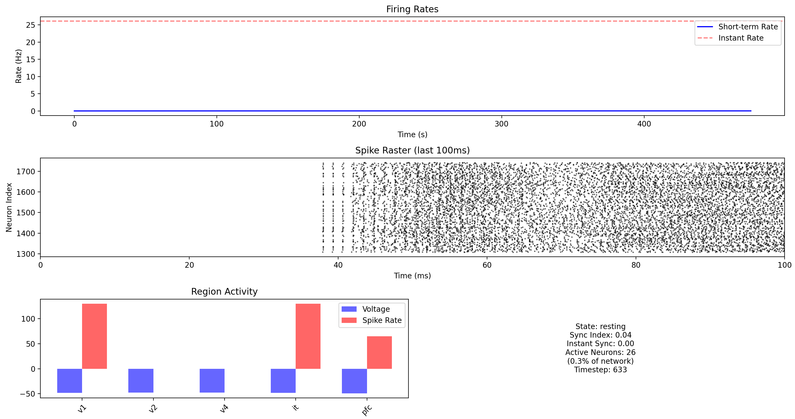

# digibrain

digital brain that can process audio + video

### Setting Up Environment

note: we need to use python 3.9 so that numba is supported

```
python3 -m venv venv
source venv/bin/activate
```

### Installing Dependencies

```
pip install -r requirements.txt
```

### Running

```
# Use cached brain (or create if not exists)
python main.py --mode test --scale 0.001

# Force creation of new brain
python main.py --mode test --scale 0.001 --force-new-brain

# Audio processing with cached brain
python main.py --mode audio --input-file "speech.mp3" --scale 0.001

# Audio processing with new brain
python main.py --mode audio --input-file "speech.mp3" --scale 0.001 --force-new-brain

# Video processing with cached brain
python main.py --mode multimodal --input-file "speech.mp4" --scale 0.001

# Video processing with new brain
python main.py --mode multimodal --input-file "speech.mp4" --scale 0.001 --force-new-brain
```

### Live Monitoring

During audio and multimodal processing there is live monitoring functionality like so:

